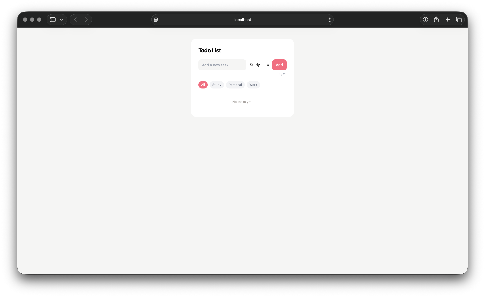

# Todo App

React + TypeScript + Tailwind CSS로 만든 Todo 앱입니다.

## 주요 기능

- Todo 추가
  - 최대 20자 입력
  - Enter / Add 버튼으로 등록
  - 빈 문자열 입력 방지
- 카테고리 선택
  - Study / Personal / Work
- 카테고리 필터
  - All / Study / Personal / Work
- Todo 완료 여부 토글
- Todo 수정
  - Edit / Save / Cancel
- Todo 삭제

## 컴포넌트 구성

```text
src/
├── App.tsx
├── types.ts
└── components/
    ├── Header.tsx
    ├── TextInput.tsx
    ├── Input.tsx
    ├── Button.tsx
    ├── CategoryFilter.tsx
    ├── TaskList.tsx
    └── TaskItem.tsx
```

- App : Todo 목록과 주요 상태 관리
- TextInput : Todo 입력 및 카테고리 선택
- Input : 공통 input 컴포넌트
- Button : 공통 button 컴포넌트
- CategoryFilter : 카테고리별 필터링
- TaskList : Todo 목록 렌더링
- TaskItem : 개별 Todo의 완료 / 수정 / 삭제 처리
- Header : Todo 앱 제목

## Todo 데이터 구조

type Category = 'Study' | 'Personal' | 'Work'

type Task = {
id: number
text: string
completed: boolean
category: Category
}

## 기술 스택

- React
- TypeScript
- Vite
- Tailwind CSS

## 실행 화면


